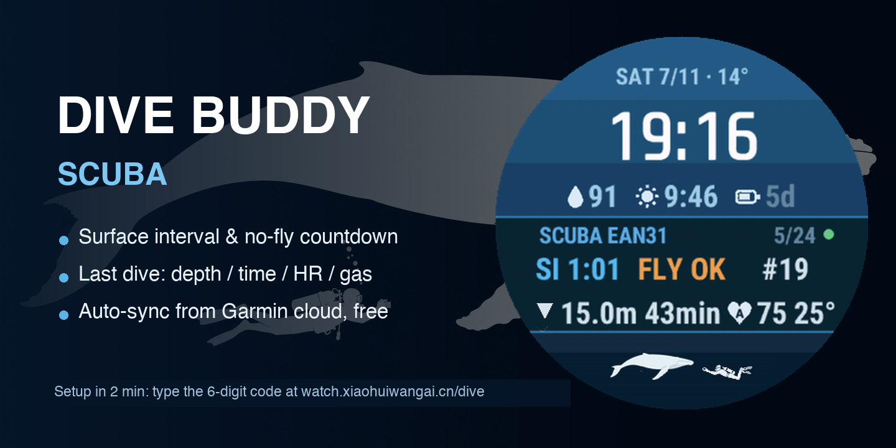
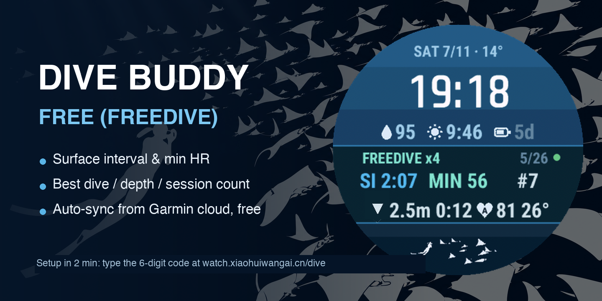

# Dive Buddy — Garmin watch faces for divers

[中文](README.md) · **English**

Two watch faces for **Garmin Descent G2**:

- 🤿 **Dive Buddy — Scuba**: surface interval, conservative no-fly countdown, last-dive stats (depth · bottom time · HR · gas), total dives.
- 🌊 **Dive Buddy — Free**: surface interval, session min-HR (your dive reflex), best single dive, session/total counts.

Data auto-syncs from your Garmin Connect account through a free hosted cloud — no server of your own, no manual URL/token.

## 📖 安装指导 / Install guide

- 水肺版 Scuba: [中文](INSTALL-DiveScuba.md) · [English](INSTALL-DiveScuba.en.md)
- 自由潜版 Free: [中文](INSTALL-DiveFree.md) · [English](INSTALL-DiveFree.en.md)

5 分钟侧载安装 + 30 秒配对码激活(含 Mac OpenMTP 步骤)。 Sideload in 5 minutes, activate with a 6-digit pair code.

## Setup (2 minutes)

1. Get the face file and sideload it (see the install guide) — the face shows a **6-digit pairing code**.
2. Open **https://watch.xiaohuiwangai.cn/dive** on your phone and type the code.
3. Bind your Garmin account there (password is used once for Garmin SSO and never stored).

Done — the face activates itself within ~10 minutes. On dive days it refreshes every 10 minutes; a **Sync now** button is on your dashboard for when you're back on the boat.

## 🔄 How often does data refresh

| Stage | Cadence |
|---|---|
| Cloud pulls from Garmin | **every 10 min** within 6 h of a dive; every 30 min within 48 h; every 2 h beyond; hourly with no recent dives |
| Watch face refresh | ~every 10 min (Garmin background cycle) |
| Manual | "Sync now" on your dashboard (5-min cooldown) |

## Privacy

- Your Garmin password is never stored; only a revocable session token is kept.
- Unbind any time on your dashboard — that wipes the tokens.
- Your data is served only to your own watch (personal token).

## Disclaimer

Dive Buddy is a watch face, **not a dive computer**. The no-fly figure is a conservative estimate (18 h after the last dive). Always follow your dive computer and your training.

## Feedback

Found a bug or want a feature? [Open an issue](../../issues/new/choose).

## Support

Dive Buddy is free. If it makes your surface intervals better, you can
[buy me a coffee ☕](https://ko-fi.com/xiaohuiwang) — it keeps the cloud running.
